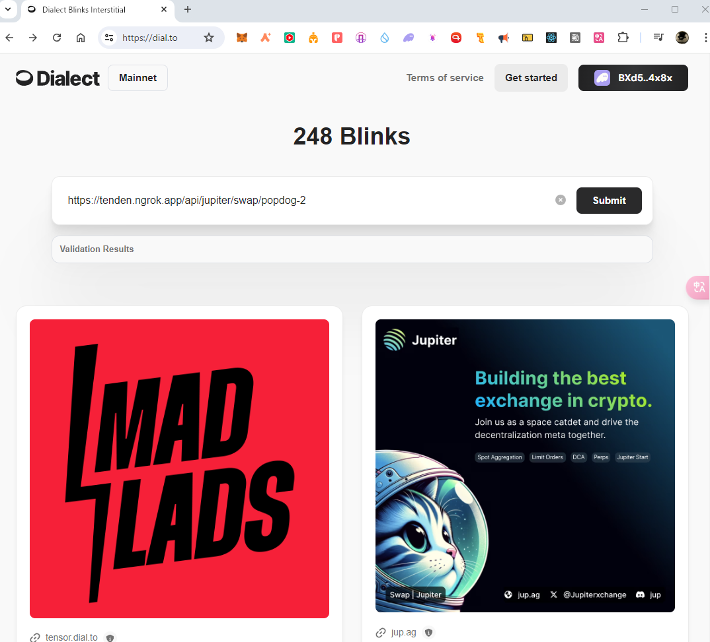
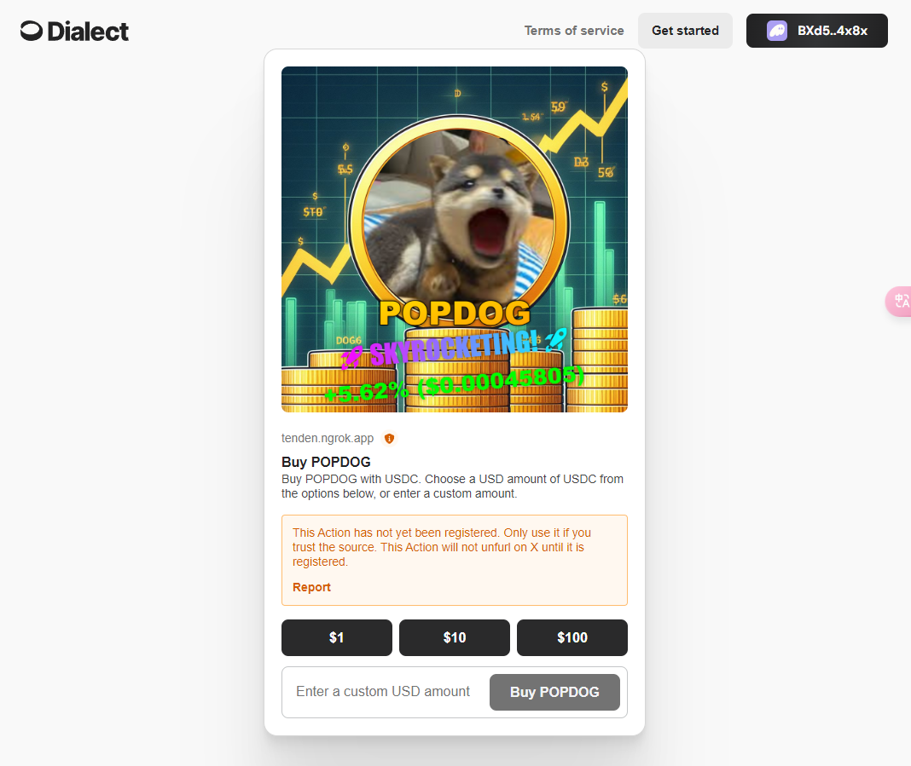
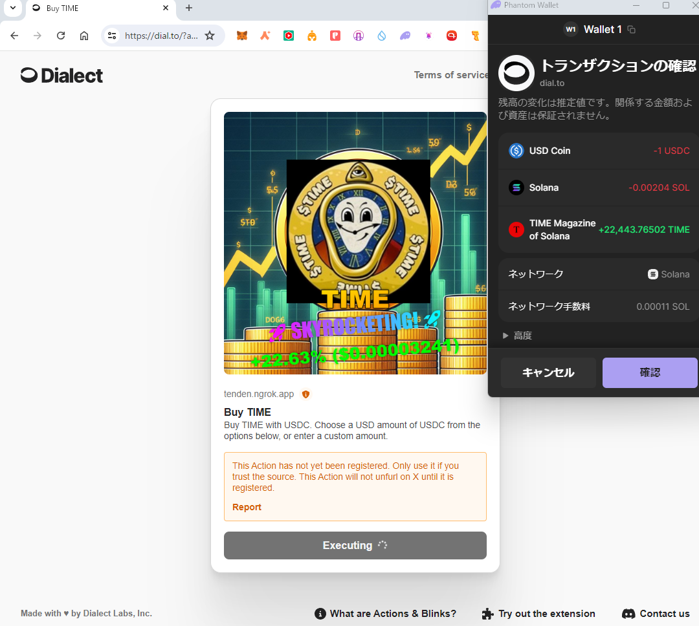
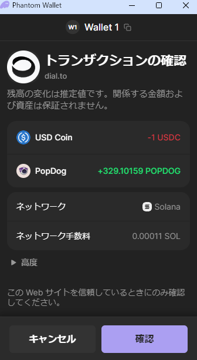

# Solana Meme Swap Action

## サービス概要

今アツいミームコインをX上ですぐさま購入するActions！(理想)

自作のActionsをX上で動くようにするには申請してホワイトリストに登録してもらう必要があるため、実際に出来たのはテスト環境での動作まで
そのためXへの投稿機能は無く、以下の主要2機能までを実装

1. CoinGecko APIを使ったSolanaミームコインのトレンド情報の抽出をするAPI
2. 指定したトークンとUSDTをJupiterでSwapするためのActions


## 利用方法
1. 直近24Hで価格上昇率の高いSolana上のミームコイン情報を取得するAPIを実行する
   
```https://tenden.ngrok.app/api/get-post-target```

Exampe Response
```
[
{
id: "time",
name: "TIME",
symbol: "TIME",
price_change_percentage_24h: 19.55685,
current_price: 0.00003243,
swap_path: "https://tenden.ngrok.app/api/jupiter/swap/time"
},
{
id: "chudjak",
name: "Chudjak",
symbol: "CHUD",
price_change_percentage_24h: 19.02422,
current_price: 0.01166532,
swap_path: "https://tenden.ngrok.app/api/jupiter/swap/chudjak"
},
{
id: "giko-cat",
name: "Giko Cat",
symbol: "GIKO",
price_change_percentage_24h: 15.34833,
current_price: 1.097,
swap_path: "https://tenden.ngrok.app/api/jupiter/swap/giko-cat"
},
{
id: "jeo-boden",
name: "Jeo Boden",
symbol: "BODEN",
price_change_percentage_24h: 8.73053,
current_price: 0.01007706,
swap_path: "https://tenden.ngrok.app/api/jupiter/swap/jeo-boden"
},
{
id: "tooker-kurlson",
name: "tooker kurlson",
symbol: "TOOKER",
price_change_percentage_24h: 6.73958,
current_price: 0.01974664,
swap_path: "https://tenden.ngrok.app/api/jupiter/swap/tooker-kurlson"
}
]
```

2. Dialectにアクセスる
```https://dial.to/```

3. URL入力欄に1で取得した`swap_path`を入力し、Submitを押す


4. Actionsのプレビューが表示される


5. トークン購入に支払う金額($USDC)を選択 or 入力し、トランザクションを確認


6. 確認ボタンを押下してトランザクションが実行できる



### Swagger UI
https://tenden.ngrok.app/swagger-ui

## 参考
https://github.com/dialectlabs/actions/tree/main